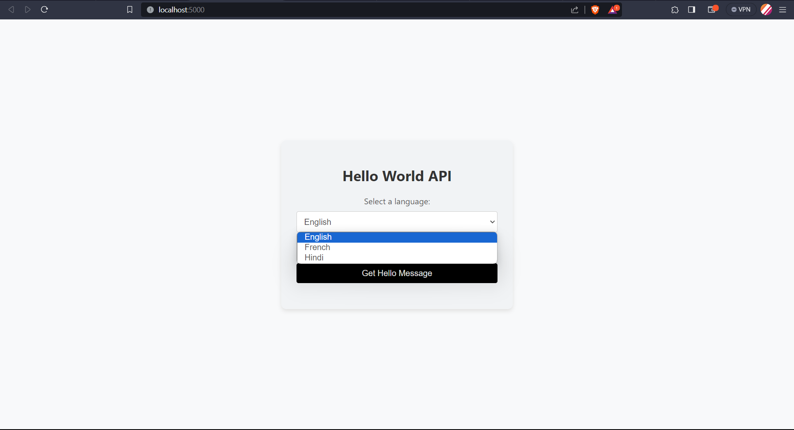

# Ignite Solution: The Hello World API Documentation

Welcome to the "Hello World" API.

## About the API
The "Hello World" API is a simple tool that allows you to retrieve a hello world message in multiple languages. It offers a straightforward way to get familiar with API concepts and is an excellent starting point for learning how to build and consume APIs.

## Getting Started

### Prerequisites
Before you begin, ensure you have the following tools installed:
- Node.js

### Installation
   Clone this repository to your local machine:
   ```
   https://github.com/Adi1121/Hello_API.git
   ```
   OR
   
   Download and Extract the Zip file in a new folder Hello_API.

### API and Webpage Setup

1. Navigate to the API directory:
```
cd Hello_API
```

2. Install required Node.js packages:
```
npm install express
```

3. Start the API and webpage server:
```
node server.js
```

### Accessing the Webpage

Open your web browser and navigate to the webpage URL (http://localhost:5000).
Choose a language from the dropdown menu.
Click the ```"Get Hello Message"``` button.
A new tab will open with the API response showing the hello world message in the selected language.

#### Direct API Responses
“Hello world”
```
http://localhost:5000/hello?language=English
```
“Bonjour le monde”
```
http://localhost:5000/hello?language=French
```
“Namastey sansar”
```
http://localhost:5000/hello?language=Hindi
```



### Contributing
We welcome contributions! If you find issues or have ideas to enhance the API or documentation, feel free to contribute through pull requests.

### License
This project is licensed under the MIT License.


